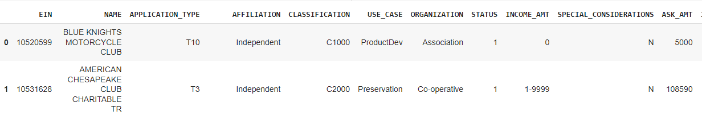
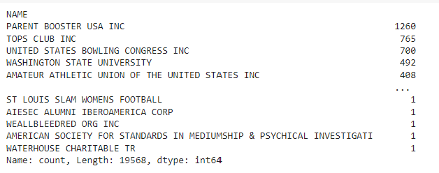
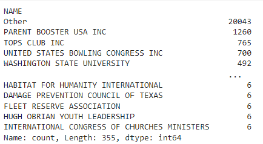
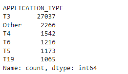
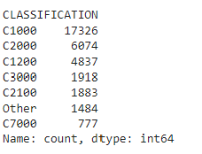
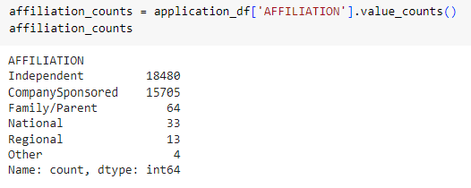
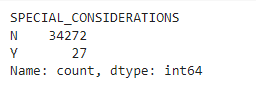
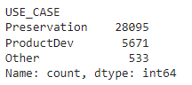

# deep-learning-challenge

The purpose of this analysis is to implement a machine learning model to accurately predict successful fundraising campaigns.  This is done based upon data from thousands of historical campaigns.  Through cleaning and preprocessing the data as well as model optimization, a model with approximately 80% accuracy for predicting success was created.

RESULTS

Preprocessing:

The data contain an IS SUCCESSFUL column with a boolean value of 0 or 1 for whether each individual project was successful.  This column was used as the target variable for the model.  Features included: 

NAME—Identification column
APPLICATION_TYPE—Alphabet Soup application type
AFFILIATION—Affiliated sector of industry
CLASSIFICATION—Government organization classification
USE_CASE—Use case for funding
ORGANIZATION—Organization type
STATUS—Active status
INCOME_AMT—Income classification
SPECIAL_CONSIDERATIONS—Special considerations for application
ASK_AMT—Funding amount requested

In the final model, the EIN identification number was removed, as the NAME column was enough for identification.  In addition, the IS SUCCESSFUL column was removed because it is the target.  

Some of the features columns required cleaning as well.  

Binning Names:

Value counts were investigated for the Names of the organizations.  This revealed that, of nearly 20,000 applications, there were quite a few organizations with a large number of applications.

It seems to be important to consider WHO is making the request, so the names were included, with any organizations with fewer than 6 applications being lumped into an 'Other' category.  This made 355 categories for name, with 20,043 applications being placed into the 'Other category.

Binning Application Types:

Similarly, binning was performed on the Application Types column, with any application types with fewer than 800 applications were placed into an 'Other' category.  The vast majority of the applications were T3 type, and the binning created an 'Other' category including 2266 applications.

Binning Classification:

Binning for Classification removed all Classifications with fewer than 500 applications into an 'Other' category.  This binning reduced the number of classification categories to seven, including the 'Other' category.

Encoding and Scaling

After the binning was done for the 3 columns mentioned above, the data were encoded using 'get_dummies'.  The data were then split into training and testing datasets, and then all columns remaining, except for the NAME column, were scaled with a Standard Scaler.

Compiling, Training, and Evaluating the Model

I set up a model with 4 layers.  The first layer included 150 neurons.  I wanted to use a fairly large number because the number of inputs was quite large after encoding the names with get-dummies.  I used a tanh activation function for this layer and for each of the remaining 3 hidden layers.  The 2nd layer had 90 neurons, the 3rd layer had 30 neurons, and the 4th layer had 16 neurons.  

I used a sigmoid activation function for the output layer.  My output was essentially binary - successful or not, so sigmoid was a good choice, especially since my y data was already either 0 or 1 for each application.

I trained and evaluated the model.  It produced an accuracy exceeding 79%, which was better than our goal of 75% accuracy.  This version of the model came after having tried several other ways of optimizing the model, which are detailed in the next section.

Previous Optimization Attempts
In my first attempt at creating the model, I removed both the EIN and the NAME columns from the features.  My logic was that these were simply for identification purposes, and that these would not have a bearing on the success of the campaigns.  This assumption was ultimately the one that I returned to that led to better model performance.  However, my first attempt did not include binning the NAME column.

I did reduce the features by binning both the application_type and the classification columns.  The intial model performance was only about  72% accuracy.  I optimized the model using keras tuner and this only marginally improved the accuracy to about 73%.  This made me believerthat I needed to return to cleaning the data in order to improve performance.  

I tried more aggressively binning the application_type and the classification to further reduce the features, but this did not provide much improvement.  Next I tried binning the affiliation to reduce features.  I created an 'Other' category for very infrequently present affiliations.

This did not significantly improve performance, and in hindsight, I see that it really did not make a big difference to the number of features.

Nevertheless, I also tried reducing the features in other ways that turned out to be insignificant.  I removed from the data any campaigns that required special consideration.  There were only 27 of these out of more than 34000 campaigns and I wondered if these could be outliers that were fooling the model.  It didn't really help.

I tried reducing features by binning the USE_CASE feature.  There were 2 categories, Preservation, and Product Development, that made up the majroity of the applications.  I thought this might help.  It didn't.

My attempts to optimize the model in this way and others are in the AlphabetSoupCharity_Optimization.ipynb file.  This file does NOT include the final, best model.  That is contained in the DeepLearning2.ipynb file.

Summary
The final model that I arrived at had an accuracy of 79%.  This was largely due to using MORE features included in the name column.  After further consideration, I realized that if someone is asking for money, people are definitely going to include whatever information they know about the person or organization making the ask in their process.  My initial attempts to improve the model did not take this into account.  By including the names of the organizations that represented the majority of the applications, I was able to improve the model's accuracy.

The keras tuner revealed that similar accuracy could be achieved with fewer nodes, and that using a relu activation function could be helpful.  The top model achieved with the keras tuner had an accuracy of 79.4 %.  This is slightly higher than the model achieved without tuning.  It used a relu activation function for the hidden layers, with 76, 86, 11, and 36 nodes in the layers.  

I think the greatest potential improvement in results might come from further cleaning the data.  Perhaps decreasing the number of name features by including counts of name up to 10 in the 'Other' column could help.  If a goal of 80% were important, I would try this and also try reducing features by removing the special considerations column, and binning Affiliations.